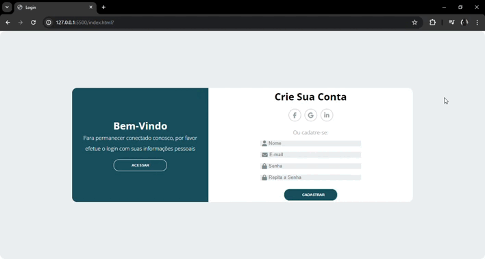

<h1> Site que consome API web de Cadastro </h1> 

## 💻 Tecnologias
<a>1 - HTML<a>  
<a>2 - CSS<a>  
<a>3 - Javascript<a>  

## 🔨 Ferramentas
IDEA: [Visual Studio Code](https://code.visualstudio.com/) &nbsp;&middot;&nbsp;  

## 📷 Tela de Inicio
  
